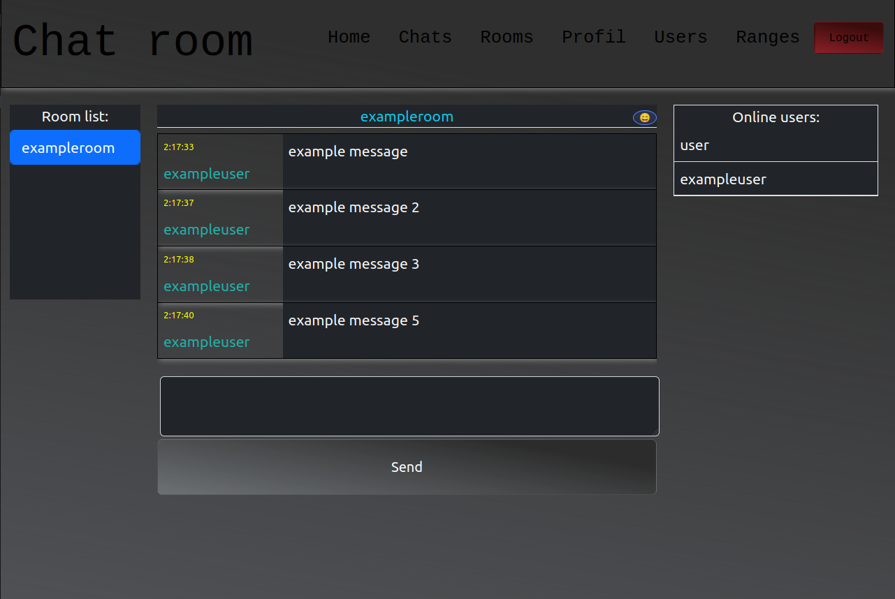

<a name="readme-top"></a>

# Chat application

<details>
  <summary>Table of Contents</summary>
  <ol>
    <li>
      <a href="#about-the-project">About The Project</a>
      <ul>
        <li><a href="#built-with">Built With</a></li>
      </ul>
    </li>
    <li>
      <a href="#getting-started">Getting Started</a>
      <ul>
        <li><a href="#prerequisites">Prerequisites</a></li>
        <li><a href="#installation">Installation</a></li>
        <li><a href="#configuration">Configuration</a></li>
        <li><a href="#testing">Testing</a></li>
      </ul>
    </li>
    <li><a href="#roadmap">Roadmap</a></li>
    <li><a href="#license">License</a></li>
    <li><a href="#contact">Contact</a></li>
  </ol>
</details>

## About the project

Chat apllication where you can



- as user:
  - chat with others in chat rooms,
  - create your own chat rooms with your own permissions for users / roles
- addidionaly as administrator:
  - create/delete ranges,
  - edit other users profiles,
  - add ranges to other users,
  - ban and unban users from chat

### Built with

- React
- MongoDB
- SocketIO
- Node

<p align="right">(<a href="#readme-top">back to top</a>)</p>

## Getting started

### Prerequisites

- MongoDB(`v6.0.4^`)
  - Community Server installed and running on your local machine - `<https://www.mongodb.com/try/download/community>
  - or use online clusters
- NodeJS - tested on `v20.2.0`

- npm

```sh
npm install npm@latest -g
```

### Installation

1. Clone the repo

```sh
git clone https://github.com/Darosss/ChatApplication.git
```

2. Navigate to server folder and install NPM packages

```sh
cd app
npm install
```

3. Navigate to frontend folder and install NPM packages

```sh
cd frontend
npm install
```

### Configuration

_The app requires several environment variables to be set in the .env file. You can use the .env.example (should be in root directory) file as a template:_

```
BACKEND_PORT=5000(whatever port u can use)
FRONTEND_URL=<fe. http://localhost:3000>
DATABASE_URL=<fe. mongodb url>

COOKIE_SECRET=<cookie secret>
JWT_SECRET_KEY=<jwt secret>

VITE_BACKEND_URL=<fe. http://localhost:5000/api/v1 >
VITE_SOCKET_ENDPOINT=<fe. http://localhost:5000 >
```

_`VITE_BACKEND_URL` - must contain `<backend url with port>/api/v1` something like this. It's only route designed_

_Both `COOKIE_SECRET` and `JWT_SECRET_KEY` are random 32 bytes string. I've used: `crypto.randomBytes(32).toString('hex')`_

<p align="right">(<a href="#readme-top">back to top</a>)</p>

### Testing

- backend:

  1. For test backend first we need to recreate testEnv file in `app/src/tests/settings`
     (in this folder should be testEnv.example which can be used for example)

  ```js
  process.env.BACKEND_PORT = 5001;
  process.env.DATABASE_URL = ""; //fe. mongodb://127.0.0.1:27017/testdb, could be online cluster too
  process.env.COOKIE_SECRET = ""; //fe. 32 bytes hex string:
  //require("crypto").randomBytes(32).toString('hex')

  process.env.JWT_SECRET_KEY = ""; //fe. 32 bytes hex string:
  //require("crypto").randomBytes(32).toString('hex')
  process.env.NODE_ENV = "test";
  ```

  2. Then just run from app folder

  ```sh
  npm test
  ```

- frontend:
  1.simply navigate to frontend folder and run:
  ```sh
  npm test
  ```

## Roadmap

- [x] Add chat rooms
- [x] Add login / register system
- [x] Add ban / unban system
- [x] Add ranges system
- [x] Improve for mobiles
- [] Add shop with privileges

<p align="right">(<a href="#readme-top">back to top</a>)</p>

## License

Distributed under the MIT License. See `LICENSE.md` for more information.

<p align="right">(<a href="#readme-top">back to top</a>)</p>

## Contact

Darosss - daroinf12@gmail.com

Project Link: [https://github.com/Darosss/ChatApplication](https://github.com/Darosss/ChatApplication)

<p align="right">(<a href="#readme-top">back to top</a>)</p>

[chat-room-screenshot]: images/chat-room.png
